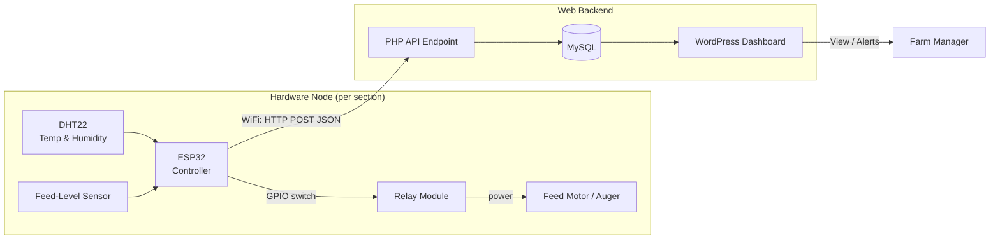

# FARMSENTRY

**Smart Feeding & Monitoring System for Broiler Poultry Farms**
Built by **Zehn Group** for [hackathon name] 2026.

FARMSENTRY automates broiler feeding and gives farm managers real-time visibility into feeding events and environmental conditions, so consistent feeding no longer depends entirely on worker availability.

---

## 1. The Problem

Research interviews with poultry farm managers (including a 90,000+ bird operation) identified recurring issues:

- Manual feeding depends on worker availability — delays happen when staff are short
- Overfeeding, caused by workers avoiding repeat refill trips
- Feed left exposed becomes contaminated or loses freshness
- Broilers are territorial and may not move to another feeder even when food is available elsewhere
- No continuous monitoring of feeding activity or house conditions
- Feed loss during milling, handling, and storage

Full research write-up: see [`/docs/research`](./docs/research).

## 2. Our Solution

An ESP32-based controller that:
1. Reads environmental data (temperature & humidity) and feed-level sensors
2. Decides when a section needs feeding — on a schedule and/or based on sensor thresholds
3. Triggers a relay to run the feed motor/auger for that section
4. Logs every feeding event and sensor reading
5. Sends that data over WiFi to a web dashboard, so managers can monitor remotely without checking every feeder by hand

## 3. System Architecture



**Data flow:** sensor reading → ESP32 decision logic → relay/motor action → event logged locally → pushed to backend → shown on dashboard.

## 4. Tech Stack

| Layer | Technology |
|---|---|
| Microcontroller firmware | ESP32, ESP-IDF framework, PlatformIO |
| Simulation (pre-hardware testing) | Wokwi |
| Sensors | DHT22 (temperature/humidity), feed-level sensor |
| Actuation | Relay module → feed motor/auger |
| Frontend | WordPress + Tailwind CSS |
| Backend | WordPress + PHP + MySQL |
| Hosting | Hostinger |

## 5. Repository Structure

```
farmsentry/
├── firmware/           # PlatformIO project (ESP-IDF)
│   ├── src/
│   ├── include/
│   ├── platformio.ini
│   ├── wokwi.toml      # Wokwi simulator config
│   └── diagram.json    # Wokwi circuit diagram
├── docs/
│   └── research/        # Farm interview + problem validation reports
├── backend/             # PHP API endpoints (if kept outside WordPress admin)
└── README.md
```

## 6. Getting Started (Firmware)

### Prerequisites

- [VS Code](https://code.visualstudio.com/)
- [PlatformIO IDE extension](https://platformio.org/install/ide?install=vscode) (installs ESP-IDF toolchain for you)
- [Wokwi Simulator extension](https://marketplace.visualstudio.com/items?itemName=wokwi.wokwi-vscode) for VS Code
- A free [Wokwi account](https://wokwi.com/) + VS Code license token (for simulating without physical hardware)
- Git

### Setup

```bash
git clone https://github.com/<org>/farmsentry.git
cd farmsentry/firmware
```

1. Open the `firmware/` folder in VS Code
2. Let PlatformIO install the ESP-IDF framework and dependencies automatically (first open takes a few minutes)
3. Press `Ctrl+Shift+P` → `Wokwi: Start Simulator` to test firmware without hardware
4. To flash real hardware: connect the ESP32 via USB, then use the PlatformIO **Upload** button

## 7. Team — Zehn Group

| Name | Role |
|---|---|
| Nakamya Flavia | Project Manager |
| Kayanja Rayaan | Researcher |
| Okene Joseph | Embedded Systems |
| Eboku Jesse | Electronics & Sensors |
| Bindja Jessica | Engineer |
| Kabenge Aydin | UI/UX Designer |
| Gach Peter | Developer |
| Kizito Fahad | Developer / Computer Science |

## 8. Status

🚧 Prototype in progress — hardware team currently wiring sensors and firmware logic; web dashboard in development.

## 9. License

TBD
